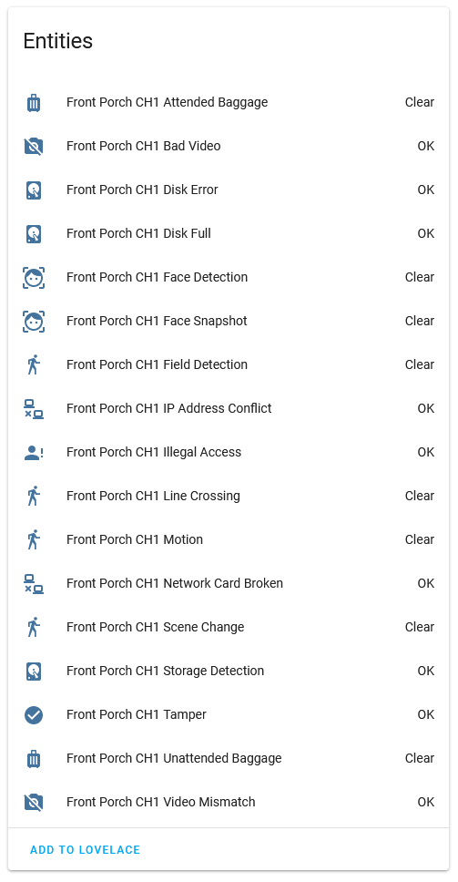

<p align="center">
  
</p>

<p align="center">
   <a href="https://github.com/CornerBit/HikSink/releases">
      
   </a>
   <a href="https://github.com/CornerBit/HikSink/blob/main/LICENSE">
      
   </a>
   
</p>

HikSink streams Hikvision camera and NVR events (motion, line crossing, tamper, illegal logins, etc.) to MQTT messages for consumption by home automation software like Home Assistant. Some key features of HikSink are:

  * **Easy Camera Authentication:** Supports digest authentication used by default by Hikvision so you don't need to lower your security settings.
  * **Full Event Type Support:** Automatically learns event types that HikSink doesn't yet know about.
  * **Home Assistant Integration:** Supports the Home Assistant MQTT discovery protocol. Provides offline notifications for individual cameras.
  * **Failure hardened:** Connections to cameras lost due to network issues or exceptions are automatically reestablished.
  * **Low CPU and memory footprint:** Written in Rust and requires less than 20 MB of memory. Can easily run on a Raspberry Pi.

For example, these are the entities discovered on a DS-2CD2185FWD-I IP camera automatically loaded into Home Assistant:

<p align="center">
  
</p>

## Installation

### Option 1: Docker

The easiest way to run HikSink is with the provided Docker image.

1. Download and modify the [sample_config.toml](sample_config.toml) file to include your MQTT and camera details.
2. Run the docker container.
   ```bash
   docker run -d \
      --name=hiksink \
      --restart=unless-stopped \
      -v <path/to/config.toml>:/app/config.toml \
      cornerbit/hiksink:latest
   ```

### Option 2: Running Standalone

1. Install the `rust` programming language compiler.
2. Clone the repository into a folder of your choosing.
   ```bash
   git clone https://github.com/CornerBit/HikSink
   ```
3. Compile the HikSink binary.
   ```bash
    cd HikSink
    cargo build --release
   ```
4. Copy the sample config and modify it to include your MQTT and camera details.
   ```bash
   cp sample_config.toml config.toml
   ```
5. Run it!
   ```bash
    ./target/release/hik_sink
   ```

## Development

A dev container is provided to ease setup and testing. It's optional, but brings along a working Home Assistant instance, MQTT server, and the rust compiler.

Some tests use the [insta](https://github.com/mitsuhiko/insta) snapshot testing library. This is installed automatically in the dev container.